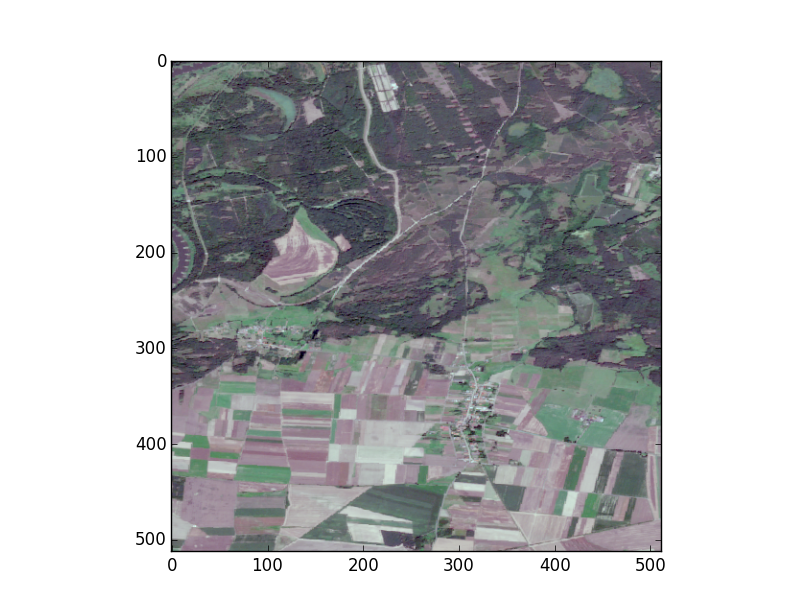
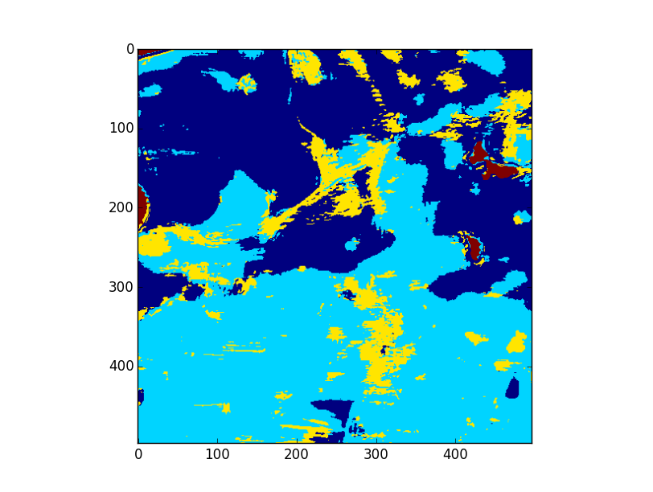

PCA-SVM Exercise
===============

Goals
-----

- Use PCA dimensionality reduction as a very basic way to compute features
- Use SVM to classify based on features

Requirements
-----
- numpy
- scikit learn
- matplotlib

Exercise
-----

Download the following datasets: 
- [Sentinel 2 hyperspectral training data](data/s2_training_data.npz)
- [Sentinel 2 hyperspectral test data](data/s2_test_data.npz)

This exercise assumes that you completed the [PCA exercise](PCA-exercise.md). In this exercise, we want to train a SVM to classify pixels in satellite images into one of four classes:
- Forest
- Field
- Urban
- Water

The datasets contain 5k crops per class. Each crop is 15x15 pixels in size with 4 channels per pixel. The label of the central pixel is given in a separate array. Since the input dimensionality of each crop is quite high (4x15x15 = 900), we want to compress it using PCA.

### Task 1

Use the functions implemented for the [PCA exercise](PCA-exercise.md) to compute the mean and principal components. Compute a 16-dimensional feature vector for each training sample by using the "compute_features" function.

### Task 2

Train a support vector machine on the computed features and the corresponding labels. Hint:
```python
from sklearn import svm
clf = svm.SVC(gamma=0.001, C=100.)
```
Also look at the [knn classification exercise](knn-classification-exercise.md).

### Task 3

Compute the accuracy on the training dataset.

### Task 4

Load the test dataset. Compute features for it as well (remember to compute the logarithm of the data first) and evaluate the classifier on the test dataset.

What is the training accuracy for 16, 32, and 256 principal components. What is the test accuracy for those? How long does training/inference take (roughly)?

### Task 5 (Bonus task)

Classify this [image](data/s2_application_data.npz). Use a "sliding window" approach where you crop a window of 15x15 pixels from the source image, use that to infer the label of the central pixel, and then repeat with a crop offset by one pixel to classify the next pixel.

Note that compute_features expects an array of crops instead of a single crop which means that you need to turn your crop into an array containing just one crop.

Simply render the final label map with:
```python
plt.imshow(application_labels)
plt.show()
```
It should look something like this:
 


